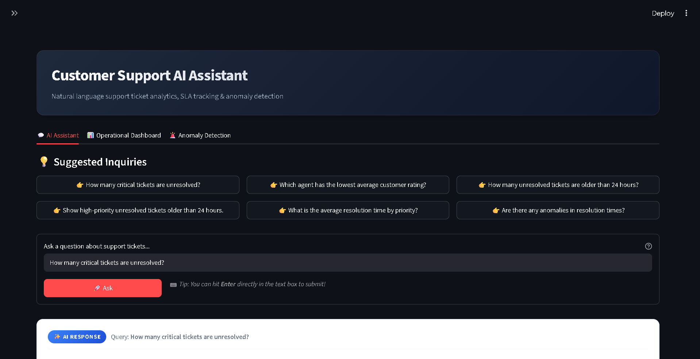
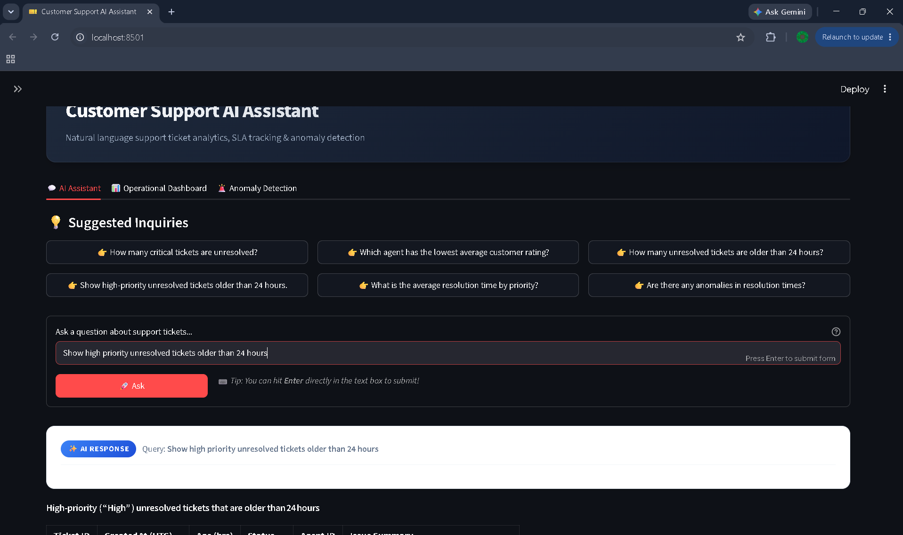

# Customer Support AI Analytics System

An end-to-end AI-powered support ticket analytics and anomaly detection system built with FastAPI, Streamlit, LangChain, Groq LLM, and SQLite.

---

## Problem Statement

> **Objective:**
> Given a customer support ticket dataset (`support_tickets.csv`), build an end-to-end AI-powered system that does all of the following:
> 1. **Ingest & Persist:** Ingest the raw CSV data, clean and validate it, engineer operational features, and store it in a queryable SQLite database.
> 2. **Natural Language Q&A:** Answer natural language questions about the ticket data (e.g., "How many critical tickets are unresolved?", "Which agent has the lowest average customer rating?").
> 3. **Anomaly Detection:** Detect and flag operational anomalies (e.g., unresolved high-priority tickets older than 24 hours, critical unresolved tickets, and statistical resolution time outliers using IQR).
> 4. **Dual Interface:** Expose full functionality via a **FastAPI REST API** and an interactive **Streamlit UI** (where Streamlit communicates with the backend exclusively via HTTP).
> 5. **LLM Orchestration:** Use an LLM for natural language interpretation while delegating all data retrieval and mathematical calculations to deterministic tools without hallucination.

---

## Step-by-Step Implementation Workflow

The system was developed modularly across 8 distinct pipeline stages:

```text
       1. CSV Parsing
             |
  2. Validation + Cleaning
             |
   3. Feature Engineering
             |
    4. Store / Query Layer (SQLite)
             |
5. Analytics + Anomaly Detection
             |
   6. LLM (Groq) + LangChain
             |
       7. FastAPI Backend
             |
     8. Streamlit UI (Frontend)
```

### Stage-by-Stage Breakdown:

* **Stage 1 — CSV Parsing (`app/pipeline/parser.py`)**:
  Parses raw CSV records with type casting for timestamps and numerics while preserving legitimate null values.
* **Stage 2 — Validation & Cleaning (`app/pipeline/validator.py`, `app/pipeline/cleaner.py`)**:
  Validates schema constraints, catches corrupt dates or impossible values, deduplicates rows, and normalizes strings.
* **Stage 3 — Feature Engineering (`app/pipeline/feature_engineer.py`)**:
  Generates deterministic flags and metrics such as `is_unresolved`, `is_critical_unresolved`, `ticket_age_hours`, and `unresolved_age_hours`.
* **Stage 4 — SQLite Store & Query Layer (`app/database/`)**:
  Loads processed records into an indexed SQLite database and provides a secure, parameterized query repository.
* **Stage 5 — Analytics & Anomaly Detection (`app/analytics/`, `app/anomalies/`)**:
  Computes volume, backlog, agent ratings, resolution times, and flags SLA breaches alongside statistical 1.5x IQR outliers.
* **Stage 6 — LangChain + Groq LLM (`app/llm/`)**:
  Connects a deterministic tool-calling LangChain agent to Groq LLM (`openai/gpt-oss-120b` / `llama-3.3-70b-versatile`), grounding answers in verified database evidence.
* **Stage 7 — FastAPI REST API (`app/api/`)**:
  Exposes REST endpoints (`GET /health`, `POST /ask`, `GET /analytics/summary`, `GET /anomalies`) with Pydantic request/response schemas and CORS support.
* **Stage 8 — Streamlit Web UI (`app/ui/`)**:
  A modern, responsive dashboard communicating exclusively with FastAPI over HTTP with Enter-to-submit Q&A, executive KPIs, and anomaly filters.

---

## System Architecture

```text
                      STREAMLIT UI (Port 8501)
                     (app/ui/streamlit_app.py)
                                 |
                                 | HTTP (APIClient)
                                 v
                     FASTAPI REST API (Port 8000)
                         (app/api/main.py)
                                 |
        +------------------------+------------------------+
        |                        |                        |
        v                        v                        v
    POST /ask          GET /analytics/summary       GET /anomalies
        |                        |                        |
        v                        v                        v
  LangChain Agent        Analytics Metrics        Anomaly Detectors
        |                        |                        |
        v                        +-----------+------------+
    Groq LLM                                 |
(openai/gpt-oss-120b)                        |
        |                                    |
        v                                    |
  Deterministic Tools                        |
        |                                    |
        +--------------------+---------------+
                             |
                             v
                     SQLite Store Layer
                  (data/support_tickets.db)
```

---

## Tech Stack

| Layer | Technology | Purpose |
| :--- | :--- | :--- |
| Language | Python 3.10+ | Core programming language |
| Data Processing | Pandas, NumPy | CSV parsing, cleaning, feature engineering |
| Database | SQLite3 | Local indexed relational storage & queries |
| LLM & Agent | LangChain, Groq API | Natural language orchestration & tool dispatch |
| Backend API | FastAPI, Uvicorn, Pydantic | REST API endpoints, schemas, CORS |
| Frontend UI | Streamlit, Requests | Interactive web dashboard & HTTP client |
| Testing | Pytest | 103 automated unit and integration tests |

---

## Detailed Folder Structure

```text
.
├── app/
│   ├── __init__.py
│   ├── analytics/                # Deterministic analytics & metrics
│   │   ├── __init__.py
│   │   ├── agents.py             # Agent performance & rating analytics
│   │   ├── aggregations.py       # Composite executive summaries & backlog reports
│   │   └── metrics.py            # Ticket volume, SLA & response/resolution times
│   ├── anomalies/                # Rule-based & statistical anomaly detection
│   │   ├── __init__.py
│   │   ├── detector.py           # Anomaly detector coordinator
│   │   ├── rules.py              # Business rule anomaly checks (SLA, backlog)
│   │   └── statistical.py        # Statistical IQR (1.5x) outlier detection
│   ├── api/                      # FastAPI REST application
│   │   ├── __init__.py
│   │   ├── main.py               # REST endpoints (/health, /ask, /analytics/summary, /anomalies)
│   │   └── schemas.py            # Pydantic request & response schemas
│   ├── database/                 # SQLite storage layer
│   │   ├── __init__.py
│   │   ├── connection.py         # SQLite connection manager
│   │   ├── loader.py             # DataFrame to SQLite persistence pipeline
│   │   ├── repository.py         # Parameterized query repository
│   │   └── schema.py             # Table schema & index definitions
│   ├── llm/                      # LangChain + Groq orchestration
│   │   ├── __init__.py
│   │   ├── agent.py              # Tool-calling agent execution loop
│   │   ├── config.py             # Groq client & environment configuration
│   │   ├── prompts.py            # System prompts & anti-hallucination guidelines
│   │   ├── service.py            # High-level entrypoint (ask_support_assistant)
│   │   └── tools.py              # LangChain tools wrapping deterministic functions
│   ├── pipeline/                 # Data preprocessing pipeline
│   │   ├── __init__.py
│   │   ├── cleaner.py            # Whitespace & casing normalization, deduplication
│   │   ├── feature_engineer.py   # Derived columns (ages, priority flags, SLA metrics)
│   │   ├── parser.py             # CSV parsing with strict type casting
│   │   ├── pipeline.py           # Complete end-to-end data preparation pipeline
│   │   └── validator.py          # Domain validation & schema integrity checks
│   └── ui/                       # Streamlit frontend
│       ├── __init__.py
│       ├── api_client.py         # HTTP client communicating with FastAPI
│       └── streamlit_app.py      # Streamlit web application & interactive UI
├── data/
│   └── support_tickets.db        # Populated SQLite database (500 tickets)
├── dataset/
│   └── support_tickets.csv       # Source support ticket dataset
├── tests/                        # 103 automated tests across all pipeline stages
│   ├── __init__.py
│   ├── test_analytics.py         # Analytics metric tests
│   ├── test_anomalies.py         # Rule-based & IQR anomaly detector tests
│   ├── test_api.py               # FastAPI endpoints & APIClient tests
│   ├── test_database.py          # SQLite schema, loader & repository tests
│   ├── test_feature_engineering.py# Feature engineering tests
│   ├── test_llm.py               # LLM tool definitions & agent tests
│   ├── test_parser.py            # CSV parser tests
│   └── test_validation_cleaning.py# Data validation & cleaning tests
├── .env                          # Local environment variables
├── .gitignore
├── LICENSE
├── Readme.md
└── requirements.txt              # Project dependencies
```

---

## How to Run the Project

### 1. Install Dependencies
```bash
pip install -r requirements.txt
```

### 2. Configure Environment Variables
Create or verify `.env` in the root folder:
```env
GROQ_API_KEY=your_groq_api_key_here
GROQ_MODEL=openai/gpt-oss-120b
GROQ_TEMPERATURE=0
API_BASE_URL=http://localhost:8000
```

### 3. Start the FastAPI Backend (Terminal 1)
```bash
uvicorn app.api.main:app --reload --port 8000
```
* **API Documentation (Swagger UI):** http://localhost:8000/docs
* **Health Endpoint:** http://localhost:8000/health

### 4. Start the Streamlit Frontend (Terminal 2)
```bash
streamlit run app/ui/streamlit_app.py
```
* **Web UI Application:** http://localhost:8501

---

## Running Automated Tests

Run the full pytest suite (103 unit and integration tests):

```bash
python -m pytest -v
```

All 103 tests pass covering CSV parsing, validation, cleaning, feature engineering, SQLite store, analytics, anomaly detection, LangChain orchestration, FastAPI endpoints, and the UI client.

---

## Example Inquiries to Try

You can test these questions in the **Streamlit UI** (hit Enter after typing) or via `POST /ask`:

1. `How many critical tickets are unresolved?`
2. `Which agent has the lowest average customer rating?`
3. `How many unresolved tickets are older than 24 hours?`
4. `Show high-priority unresolved tickets older than 24 hours.`
5. `What is the average resolution time by priority?`
6. `Are there any anomalies in resolution times?`

---

## Application UI Demos

### Query 1: Unresolved Critical Tickets

Question: *"How many critical tickets are unresolved?"*

#### Query Input & Interface


#### Answer, Executed Tools & Evidence Payload
.png)

---

### Query 2: High-Priority Unresolved Tickets (> 24 Hours)

Question: *"Show high-priority unresolved tickets older than 24 hours."*

#### Query Input & Response Overview


#### Unresolved Tickets Table (Age, Priority, Agent, Summary)
.png)

#### Tools Executed & Structured JSON Evidence
.png)
